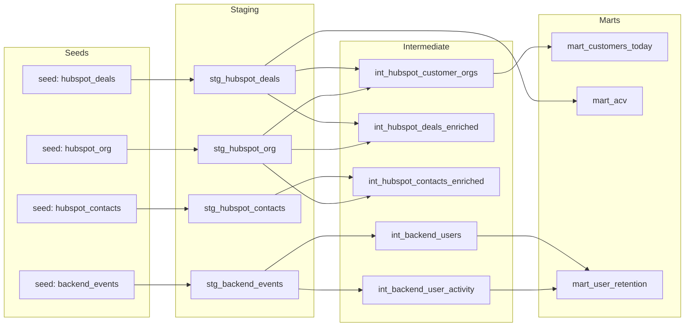

# Flinn BI — dbt-first (DuckDB)

This repo is a lean, **dbt-first** analytics project using **DuckDB** so it can run locally with zero external warehouse setup.

## Repo layout
- `dbt/flinn_bi/`: dbt project
- `dbt/flinn_bi/seeds/`: source CSVs loaded via `dbt seed` (committed)
- `data/`: raw CSV drop folder (ignored; not committed)

## How to run (local)
### 1) Create a Python env (use Python 3.11+)
From repo root:
```bash
py -3.11 -m venv .venv
.\.venv\Scripts\python -m pip install -U pip
.\.venv\Scripts\pip install -r requirements.txt
```

### 2) Configure dbt profile
Use the example profile:
```bash
copy dbt\flinn_bi\profiles.yml.example dbt\flinn_bi\profiles.yml
```

Then run dbt with that profiles directory:
```bash
cd dbt\flinn_bi
$env:DBT_PROFILES_DIR = (Get-Location).Path
dbt debug
```

### 3) Load seeds + build models
```bash
dbt seed
dbt build
```

### 4) View dbt docs in your browser (localhost)
```bash
dbt docs generate
dbt docs serve
```

## Querying the data (DuckDB)
dbt writes tables/views into the DuckDB file configured in `dbt/flinn_bi/profiles.yml` (default: `dbt/flinn_bi/flinn_bi.duckdb`).

You can query it via Python:
```bash
.\.venv\Scripts\python -c "import duckdb; con=duckdb.connect('dbt/flinn_bi/flinn_bi.duckdb'); print(con.sql('show tables').fetchall())"
```

Or connect with a SQL client that supports DuckDB (e.g., DBeaver/DataGrip) using the `.duckdb` file.

## Notes
- This is intentionally minimal; models and tests are added in later tasks.

## Data model (Task 3)
This project follows a simple 3-layer dbt structure:
- **Staging (`stg_`)**: clean column names/types and normalize join keys.
- **Intermediate (`int_`)**: relationship helpers + cohort/activity helpers.
- **Marts (`mart_`)**: final tables used to answer Q1–Q3.

### Lineage / ERD (Mermaid)


### Data quality issues (and how dbt mitigates them)
- **Key integrity:** seed IDs are non-null + unique; staging models enforce this via tests.
- **Join reliability:** HubSpot FK joins (deals/contacts → company) are validated with relationship tests.
- **Retention inflation risk:** `TokenGenerated` is excluded from the “active” definition used for retention (documented in `ASSUMPTIONS.md`).

## EDA highlights (Task 2)
- Notebook: `notebooks/01_eda.ipynb`
- Bonus insight summary: `outputs/bonus_insight.md`
- dbt-web-runnable EDA queries (dbt analyses): `dbt/flinn_bi/analyses/`
  - `dbt/flinn_bi/analyses/bonus_activation_funnel.sql`
  - `dbt/flinn_bi/analyses/backend_to_hubspot_mapping.sql`
  - `dbt/flinn_bi/analyses/eda_seed_profiling.sql`

Headline findings:
- Seeds are clean at the ID level (no null IDs, no duplicate IDs) and have consistent date coverage across 2024–2026.
- Backend events cover 37 orgs (≈14.6% of HubSpot companies); product-event retention will reflect this subset.
- Bonus insight: **62.0% (93/150)** of new users run `SearchExecuted` within 7 days of `UserCreated` (see `outputs/bonus_insight.md`).
