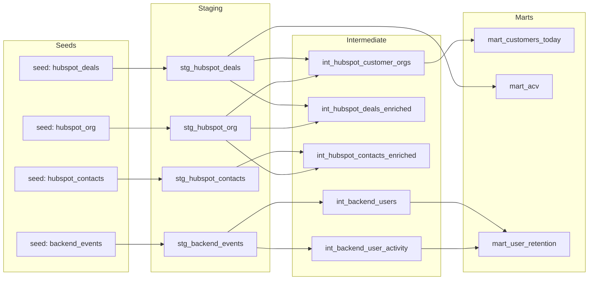

# Flinn BI — Technical Challenge (dbt-first, DuckDB)

Lean analytics repo answering Q1–Q3 with simple, review-friendly **dbt modeling** on **DuckDB** (zero external warehouse setup).

## Repo layout
- `dbt/flinn_bi/`: dbt project
- `dbt/flinn_bi/seeds/`: source CSVs loaded via `dbt seed` (committed)
- `notebooks/`: lightweight EDA
- `outputs/`: short EDA-driven write-ups

## Fork + run (quickstart)
1) Fork on GitHub, then clone your fork:
```bash
git clone <your-fork-url>
cd flinn_bi_project
```

2) Follow **How to run (local)** below to create a venv, install deps, configure the dbt profile, and run `dbt seed` / `dbt build`.

## How to run (local)
### 1) Create a Python env (Python 3.11+)
From repo root:
```bash
py -3.11 -m venv .venv
.\.venv\Scripts\python -m pip install -U pip
.\.venv\Scripts\pip install -r requirements.txt
```

### 2) Configure dbt profile
```bash
copy dbt\flinn_bi\profiles.yml.example dbt\flinn_bi\profiles.yml
```

### 3) Seed + build + test
```bash
cd dbt\flinn_bi
$env:DBT_PROFILES_DIR = (Get-Location).Path
dbt debug
dbt seed
dbt build
```

Notes:
- If you have a global dbt installed, make sure you’re using the venv’s dbt (activate the venv, or run `..\..\.venv\Scripts\dbt ...`).
- The DuckDB file `dbt/flinn_bi/flinn_bi.duckdb` is created/updated after `dbt build`.

### 4) View dbt docs in your browser (localhost)
```bash
dbt docs generate
dbt docs serve
```

## Answers (as of 2026-03-02)
All numbers below come from the marts in `dbt/flinn_bi/models/marts/`.

### Access DuckDB (terminal)
dbt writes to `dbt/flinn_bi/flinn_bi.duckdb` (created after you run `dbt build`).

PowerShell (via Python - Duckdb CLI):

```powershell
duckdb dbt\flinn_bi\flinn_bi.duckdb
```

### Q1) How many customers today?
- **Answer:** **26 customers**
- **Definition:** a “customer” is a HubSpot **company** with **≥ 1 Closed Won deal** (`is_closed_won = true`).
- **Model:** `analytics.mart_customers_today` (1 row per customer company)

Repro (DuckDB):
```sql
select count(*) as customer_count
from analytics.mart_customers_today;
```

### Q2) What is ACV?
- **Answer (overall):** **mean €12,967.74**, **median €12,000** (across **31** Closed Won deals; currency in data is **EUR**)
- **Definition:** HubSpot `amount` is treated as **ACV** (see caveats in `ASSUMPTIONS.md`).
- **Model:** `analytics.mart_acv`

Repro (DuckDB):
```sql
select closed_won_deal_count, mean_acv, median_acv
from analytics.mart_acv
where acv_definition = 'all_closed_won';
```

### Q3) What is retention?
- **Definition:** **monthly cohort “activity rate”** for backend users
  - cohort = month of first `UserCreated` per `user_id`
  - active in month N = user has **any** backend event **excluding**: `TokenGenerated`, `UserCreated`, `UserUpdated`, `OrganizationCreated`, `OrganizationUpdated`
- **Aggregation (weighted across cohorts):**
  - `retention_rate(period N) = sum(active_users at period N) / sum(cohort_size)`
- **Headline (weighted across cohorts):** month 0 **84.0%**, month 1 **99.3%**, month 3 **96.6%**, month 6 **92.4%**, month 12 **87.1%**
- **Model:** `analytics.mart_user_retention`

Weighted retention across cohorts (presentation view):


Repro (DuckDB):
```sql
select
  period_number,
  sum(active_users)::double / sum(cohort_size) as retention_rate
from analytics.mart_user_retention
group by 1
order by 1;
```

## Assumptions + data quality
- Assumptions log: `ASSUMPTIONS.md`

Top issues (and impact):
- **Backend ↔ HubSpot coverage is partial:** backend events cover **37 orgs**; HubSpot-derived metrics (customers/ACV) apply to all HubSpot companies, while retention reflects only the product-event subset.
- **Mapping relies on `UserCreated` email:** `event_properties.user.email` is not consistently present on other event types, so the mapping is built from `UserCreated` and then applied via `user_id` / `organization_id` joins.
- **“Retention” is an activity rate:** users can be inactive in month 0 but active in month 1+, so the curve can increase (this is expected under this definition).

## Bonus insight (EDA-driven)
- **Activation funnel:** **62.0% (93 / 150)** of new users execute `SearchExecuted` within 7 days of `UserCreated`.
- Write-up: `outputs/bonus_insight.md`
- Repro queries (dbt analyses): `dbt/flinn_bi/analyses/bonus_activation_funnel.sql`

## Data model
This project follows a simple 3-layer dbt structure:
- **Staging (`stg_`)**: clean column names/types and normalize join keys
- **Intermediate (`int_`)**: relationship helpers + cohort/activity helpers
- **Marts (`mart_`)**: final tables used to answer Q1–Q3

### Lineage / ERD (Mermaid)


## Next 6 months roadmap (product-minded)
- Automate ingestion (daily) + add source freshness checks
- Introduce dimensional model (accounts/users) and consistent IDs across systems
- Expand activation + retention to customer/non-customer segments
- Add deal attribution (product usage → pipeline outcomes) with documented limitations
- Establish metric contracts (tests + docs) and governance for definitions
- Add simple dashboards for exec KPIs (customers, ACV, activation, retention)
