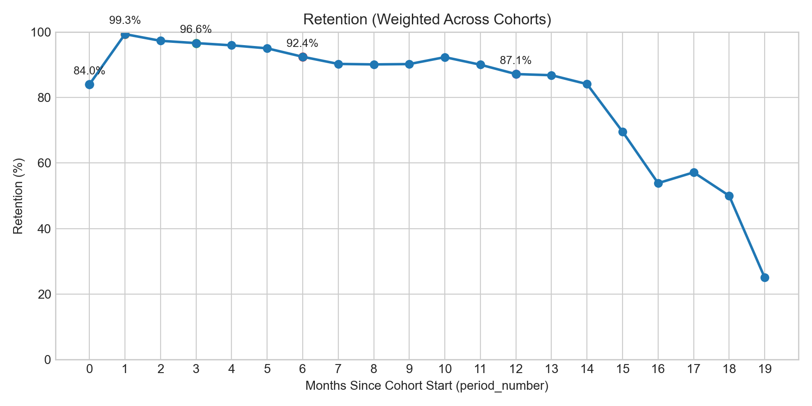
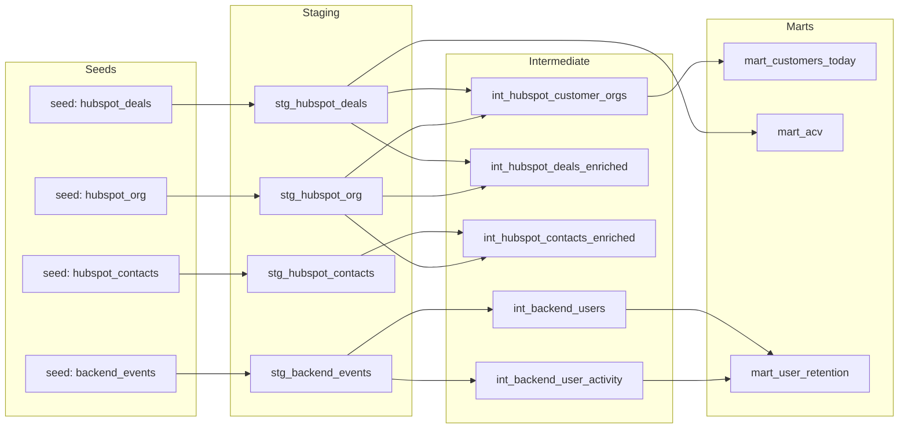
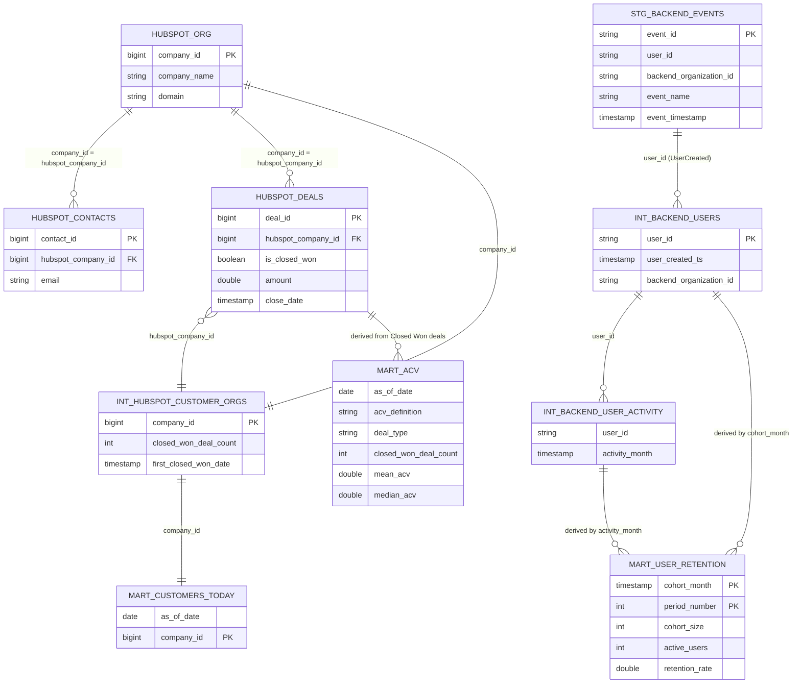

# Flinn BI — Technical Challenge (dbt-first, DuckDB)

Lean analytics repo answering Q1–Q3 with simple, review-friendly **dbt modeling** on **DuckDB** (zero external warehouse setup).

## Repo layout
- `dbt/flinn_bi/`: dbt project
- `dbt/flinn_bi/seeds/`: source CSVs loaded via `dbt seed` (committed)
- `notebooks/`: lightweight EDA
- `outputs/`: short EDA-driven write-ups

## Fork + run (quickstart)
1) Fork on GitHub, then clone your fork:
```bash
git clone <your-fork-url>
cd flinn_bi_project
```

2) Follow **How to run (local)** below to create a venv, install deps, configure the dbt profile, and run `dbt seed` / `dbt build`.

## How to run (local)
### 1) Create a Python env (Python 3.11+)
From repo root:
```bash
py -3.11 -m venv .venv
.\.venv\Scripts\python -m pip install -U pip
.\.venv\Scripts\pip install -r requirements.txt
```

### 2) Configure dbt profile
```bash
copy dbt\flinn_bi\profiles.yml.example dbt\flinn_bi\profiles.yml
```

### 3) Seed + build + test
```bash
cd dbt\flinn_bi
$env:DBT_PROFILES_DIR = (Get-Location).Path
dbt debug
dbt seed
dbt build
```

Notes:
- If you have a global dbt installed, make sure you’re using the venv’s dbt (activate the venv, or run `..\..\.venv\Scripts\dbt ...`).
- The DuckDB file `dbt/flinn_bi/flinn_bi.duckdb` is created/updated after `dbt build`.

### 4) View dbt docs in your browser (localhost)
```bash
dbt docs generate
dbt docs serve
```

### 5) Offline dbt docs (no install)
This repo includes a pre-generated static docs snapshot under `docs/`.

- Open `docs/static_index.html` directly (Windows: `Start-Process docs\\static_index.html`).
- To regenerate after making changes:
  ```powershell
  cd dbt\flinn_bi
  $env:DBT_PROFILES_DIR = (Get-Location).Path
  ..\..\.venv\Scripts\dbt docs generate --static --target-path ..\..\docs --profiles-dir .
  ```

## Answers (as of 2026-03-02)
All numbers below come from the marts in `dbt/flinn_bi/models/marts/`.

### Access DuckDB (terminal)
dbt writes to `dbt/flinn_bi/flinn_bi.duckdb` (created after you run `dbt build`).

PowerShell (via Python - Duckdb CLI):

```powershell
duckdb dbt\flinn_bi\flinn_bi.duckdb
```

### Q1) How many customers today?
- **Answer:** **26 customers**
- **Definition:** a “customer” is a HubSpot **company** with **≥ 1 Closed Won deal** (`is_closed_won = true`).
- **Model:** `analytics.mart_customers_today` (1 row per customer company)

Repro (DuckDB):
```sql
select count(*) as customer_count
from analytics.mart_customers_today;
```

### Q2) What is ACV?
- **Answer (overall):** **mean €12,967.74**, **median €12,000** (across **31** Closed Won deals; currency in data is **EUR**)
- **Definition:** HubSpot `amount` is treated as **ACV** (see caveats in `ASSUMPTIONS.md`).
- **Model:** `analytics.mart_acv`

Repro (DuckDB):
```sql
select closed_won_deal_count, mean_acv, median_acv
from analytics.mart_acv
where acv_definition = 'all_closed_won';
```

### Q3) What is retention?
- **Definition:** **monthly cohort “activity rate”** for backend users
  - cohort = month of first `UserCreated` per `user_id`
  - active in month N = user has **any** backend event **excluding**: `TokenGenerated`, `UserCreated`, `UserUpdated`, `OrganizationCreated`, `OrganizationUpdated`
- **Aggregation (weighted across cohorts):**
  - `retention_rate(period N) = sum(active_users at period N) / sum(cohort_size)`
- **Headline (weighted across cohorts):** month 0 **84.0%**, month 1 **99.3%**, month 3 **96.6%**, month 6 **92.4%**, month 12 **87.1%**
- **Model:** `analytics.mart_user_retention`

Weighted retention across cohorts (presentation view):




Repro (DuckDB):
```sql
select
  period_number,
  sum(active_users)::double / sum(cohort_size) as retention_rate
from analytics.mart_user_retention
group by 1
order by 1;
```

## Assumptions + data quality
- Assumptions log: `ASSUMPTIONS.md`

Top issues (and impact):
- **Backend ↔ HubSpot coverage is partial:** backend events cover **37 orgs**; HubSpot-derived metrics (customers/ACV) apply to all HubSpot companies, while retention reflects only the product-event subset.
- **Mapping relies on `UserCreated` email:** `event_properties.user.email` is not consistently present on other event types, so the mapping is built from `UserCreated` and then applied via `user_id` / `organization_id` joins.
- **“Retention” is an activity rate:** users can be inactive in month 0 but active in month 1+, so the curve can increase (this is expected under this definition).

## Bonus insight (EDA-driven)
- **Activation funnel:** **62.0% (93 / 150)** of new users execute `SearchExecuted` within 7 days of `UserCreated`.
- Write-up: `outputs/bonus_insight.md`
- Repro queries (dbt analyses): `dbt/flinn_bi/analyses/bonus_activation_funnel.sql`

## Data model
This project follows a simple 3-layer dbt structure:
- **Staging (`stg_`)**: clean column names/types and normalize join keys
- **Intermediate (`int_`)**: relationship helpers + cohort/activity helpers
- **Marts (`mart_`)**: final tables used to answer Q1–Q3

### Lineage / ERD (Mermaid)


### ERD (keys used for joins)
This ERD focuses on the **join keys** used across the main entities (HubSpot objects, backend events, and the derived marts).



Note: backend ↔ HubSpot linking is **not** a native key match (UUID vs bigint). When needed for analysis, it’s done via `UserCreated` email extracted from `event_properties` and joined to `hubspot_contacts.email` (see `dbt/flinn_bi/analyses/backend_to_hubspot_mapping.sql`).


## AI collaboration (how I used AI in this exercise)
I used AI (Codex/ChatGPT) mostly as a productivity boost: scaffolding the project structure, sketching dbt model templates, and drafting early versions of queries so I could iterate faster.

I still personally owned the important parts: the business definitions (Customer, ACV, Retention), the join strategy, and the final interpretation of results. I also reviewed/edit AI-generated code for readability and correctness, and I rewrote things when the logic didn’t match the dataset or the metric I actually wanted.

I treat AI as an accelerator, not a magic wand. In practice I break work into small subtasks, walk through them step-by-step with the agent, and sanity-check outputs after each step. The agent doesn’t “decide” what’s final — it’s kept on a tight leash with explicit constraints and lots of review, so it can’t wander off and build something I didn’t ask for.

### What I verified manually
- Metric sanity checks: counts, date ranges, duplicates, null handling, and cross-checks across tables
- dbt model grains and key constraints (e.g., one row per org/customer where expected)
- dbt runs: `dbt seed` / `dbt build` run cleanly, and tests catch obvious issues
- Assumptions + edge cases: anything non-obvious is captured in `ASSUMPTIONS.md`

### Why this workflow
This mirrors how I work in practice: AI helps get to a solid first draft quickly, and then I spend my time on correctness, trust, and explainability (the parts that matter most in analytics and data modeling).

### How I’d approach this role going forward
If I joined Flinn, I’d keep using AI heavily — but in a regulated, guided way. I start with the business problem and the decision it supports, then pick the simplest tech that solves it (AI or not). If a tool doesn’t move a real metric or unblock a real workflow, it’s just expensive noise.

Over time, repeatable processes with predictable outcomes can be carefully delegated to AI agents, with data security as the first constraint (especially with proprietary models). The bigger part of the job stays human: stakeholder management, learning the business dynamics, and treating BI as a data product — not chasing shiny tech without a use case.
